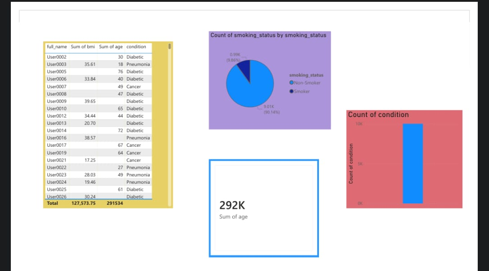
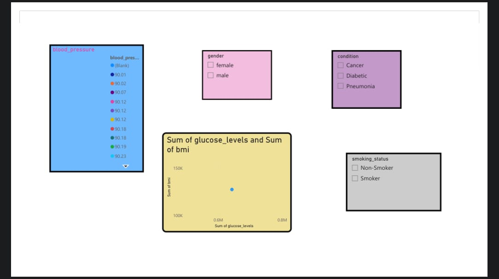

## Project Overview
This project analyzes a medical dataset containing patient information such as age, gender, BMI, blood pressure, glucose levels, smoking status, and medical conditions. The objective is to identify health patterns and gain insights through data visualization using Power BI and Python.

## Dataset Description

The dataset contains the following attributes:

- Patient ID
- Full Name
- Age
- Gender
- Smoking Status
- BMI (Body Mass Index)
- Blood Pressure
- Glucose Levels
- Medical Condition

The medical conditions included in the dataset are:

- Diabetic
- Pneumonia
- Cancer

### Visualization
## Disease Distribution Chart

### Disease Distribution Chart

The chart shows the number of patients affected by different medical conditions. From the analysis, Diabetes has the highest number of cases, followed by Pneumonia and Cancer. This visualization helps in understanding disease prevalence within the dataset.

## Tools Used

- Python
- Pandas
- Matplotlib
- Power BI

  

## Conclusion

This project demonstrates how healthcare data can be analyzed and visualized to identify trends and support data-driven decision-making.
